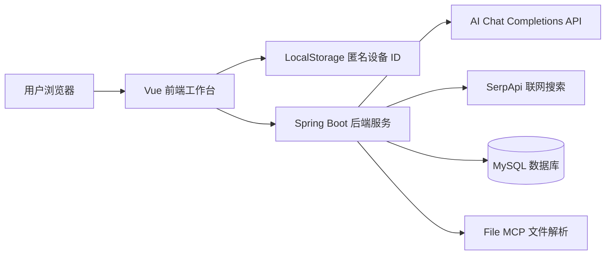
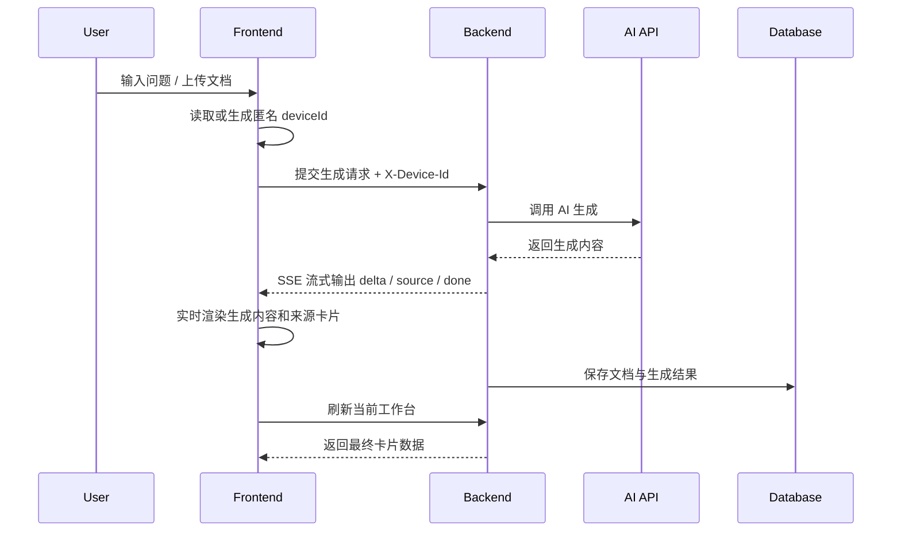
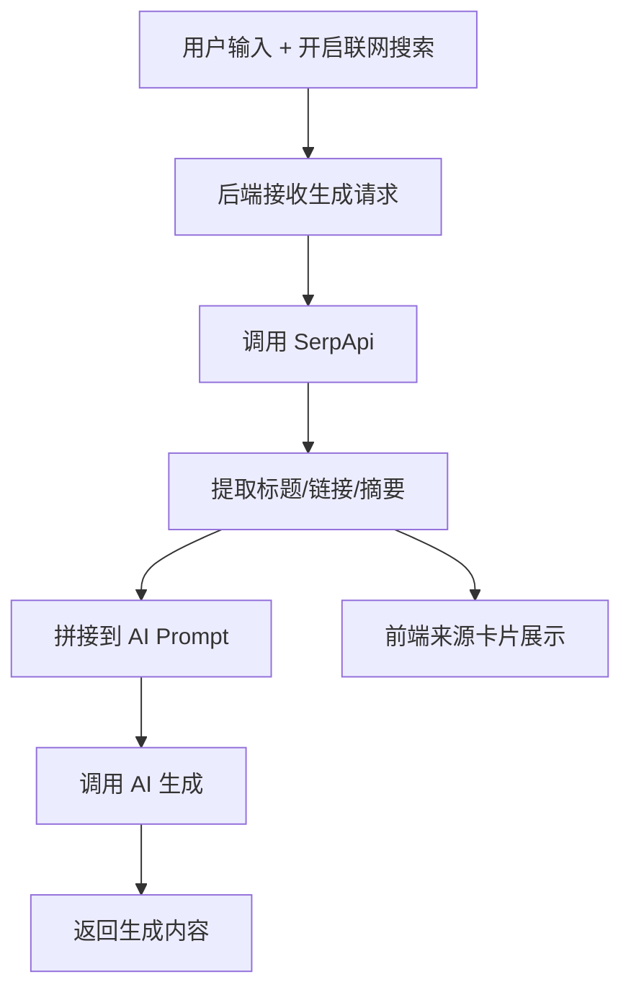
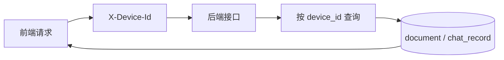

# 文枢 NexusDoc

> AI 卡片生成式文档工作台，让每一份文档都成为可追问、可归档、可复用的知识。


## 1. 项目简介

文枢 NexusDoc 是一个 AI 卡片生成式文档工作台。

它不是普通聊天机器人，而是一个用于把文档、问题、会议记录、课程资料、小说设定、项目资料等文本内容转化为可追问、可归档、可复用知识卡片的 AI 文档知识操作系统。

用户可以粘贴长文本、输入问题或上传文档，系统会调用兼容 Chat Completions 的 AI 接口进行文档理解与内容生成，并将结果整理为摘要卡、观点卡、任务卡、引用卡、结构卡等知识卡片。生成结果支持流式输出、继续追问、联网搜索增强、参考来源展示、档案夹归档和设备级历史隔离。

## 2. 项目亮点

- **AI 卡片生成式工作台**：将长文本和问题拆解为摘要卡、观点卡、任务卡、引用卡和结构卡。
- **类 GPT 流式输出体验**：后端通过 SSE 返回生成内容，前端使用 ReadableStream 实时渲染。
- **联网搜索增强**：可选调用 SerpApi 获取外部资料，生成来源卡片和引用信息。
- **设备级历史隔离**：无需登录注册，前端生成匿名设备 ID，后端按 `X-Device-Id` 隔离历史记录。
- **档案夹归档复用**：支持将工作台会话移动到不同档案夹，沉淀可复用资料。
- **继续追问**：针对已生成文档继续提问，保存追问记录。
- **文档上传处理**：支持 txt、md、markdown、csv、json、docx、pdf 等文件解析与生成。
- **响应式工作台界面**：桌面端强调卡片式工作台，移动端提供抽屉菜单和紧凑输入栏。

## 3. 核心功能

### 3.1 文档处理

- 粘贴长文本、输入问题或处理需求。
- 上传文档并通过 FileInsight MCP 流程解析内容。
- 支持通用总结、会议纪要、提取重点、正式改写、思维导图、小说设定、趋势分析等模式。
- 生成结果保存为工作台历史，可后续继续查看和追问。

### 3.2 AI 知识卡片

- 摘要卡：压缩长文核心内容。
- 观点卡：提取判断、观点和分析角度。
- 任务卡：整理行动项、待办和后续步骤。
- 引用卡：展示参考来源和可追溯信息。
- 结构卡：呈现层级结构、思维导图类内容。
- 原始生成文本查看：保留 AI 原始输出，便于调试和复核。

### 3.3 联网搜索增强

- 可通过前端开关启用联网搜索。
- 后端调用 SerpApi 获取标题、链接、摘要等参考资料。
- 前端展示来源卡片，并支持打开来源链接。
- 搜索失败时不应暴露密钥，业务上可降级为普通生成。

### 3.4 工作台历史

- 最近工作台列表。
- 历史记录页面。
- 新建工作台。
- 删除工作台。
- 置顶工作台。
- 移动到档案夹。
- 导出 / 导入当前设备数据。

### 3.5 设备级历史隔离

- 不需要登录注册。
- 前端生成匿名设备 ID。
- 请求自动携带 `X-Device-Id`。
- 后端按设备 ID 保存和查询文档、工作台、追问记录。
- 清除浏览器 localStorage 后会被视为新设备。

### 3.6 响应式界面

- 桌面端：暗金玻璃风格、左侧工作台、右侧卡片结果区、底部生成输入框。
- 手机端：单一 Header、抽屉式工作台列表、单列卡片、GPT 式底部输入栏。

## 4. 功能展示

当前仓库未提供固定截图目录。后续可以在 `docs/images` 目录中补充以下截图：

- 桌面端首页
- 生成卡片结果页
- 联网搜索来源卡片
- 手机端工作台
- 历史记录页面
- 档案夹页面

## 5. 技术栈

### 前端

| 技术 | 说明 |
| --- | --- |
| Vue 3.5 | 前端框架 |
| Vite 5 | 前端构建工具 |
| Vue Router 4 | 前端路由 |
| Element Plus 2 | 基础 UI 组件 |
| Axios / Fetch | HTTP 请求、文件上传、ReadableStream 流式消费 |
| 原生 CSS / CSS Variables | 暗金主题、响应式布局、移动端适配 |

### 后端

| 技术 | 说明 |
| --- | --- |
| Java 17 | 后端开发语言 |
| Spring Boot 3.3.5 | 后端服务框架 |
| Spring Web MVC | REST API 与 SSE 流式接口 |
| MyBatis-Plus 3.5.9 | 数据访问层 |
| Maven | 后端构建工具 |
| Lombok | Java 样板代码简化 |
| Apache PDFBox | PDF 文本解析 |
| Apache POI | docx 文档解析 |

### AI、搜索与存储

| 技术 / 服务 | 说明 |
| --- | --- |
| DeepSeek / SiliconFlow 兼容 Chat Completions API | 文档理解与内容生成 |
| SerpApi | 联网搜索增强 |
| MySQL | 文档、生成结果、追问记录存储 |
| localStorage | 前端匿名设备 ID 持久化 |

## 6. 系统架构



架构分工：

- 前端负责工作台 UI、匿名设备 ID、请求封装、流式渲染、卡片展示和移动端交互。
- 后端负责业务接口、AI Prompt 组装、AI 调用、联网搜索整合、文件解析和数据保存。
- 数据库存储文档、生成结果和追问记录。
- AI 服务负责生成摘要、观点、任务、结构、引用等内容。
- SerpApi 负责补充外部参考来源。

## 7. 目录结构

```text
NexusDoc/
├── README.md
├── pom.xml                         # Spring Boot 后端 Maven 配置
├── Dockerfile                      # 后端 Docker 构建
├── docker-compose.yml              # MySQL + 后端 + 前端编排
├── .env.example                    # 环境变量示例，不包含真实密钥
├── src/
│   └── main/
│       ├── java/com/nexusdoc/
│       │   ├── controller/         # REST API、SSE、文件接口
│       │   ├── service/            # 业务接口
│       │   ├── service/impl/       # AI、文档、搜索、文件解析实现
│       │   ├── mapper/             # MyBatis-Plus Mapper
│       │   ├── entity/             # 数据库实体
│       │   ├── dto/                # 请求 DTO
│       │   ├── vo/                 # 响应 VO
│       │   ├── common/             # 结果封装、异常、设备 ID 工具、配置
│       │   ├── ai/                 # AI 请求响应与 Prompt 模板
│       │   └── search/             # SerpApi 响应结构
│       └── resources/
│           ├── application.yml     # 后端配置
│           └── db/
│               ├── schema.sql      # 数据库初始化脚本
│               └── migration/      # 迁移 SQL
├── frontend/
│   ├── package.json                # 前端依赖与脚本
│   ├── vite.config.js              # Vite 与 /api 代理
│   ├── Dockerfile                  # 前端 Docker 构建
│   ├── nginx.conf                  # 前端容器 Nginx 配置
│   └── src/
│       ├── api/                    # 前端 API 封装
│       ├── views/                  # 页面视图
│       ├── router/                 # Vue Router
│       ├── utils/                  # 设备 ID、AI 结果格式化等工具
│       ├── config/                 # 前端常量
│       └── assets/                 # 全局样式
└── target/                         # Maven 构建输出，通常不需要手动维护
```

## 8. 快速开始

### 8.1 准备环境

建议环境：

- JDK 17
- Maven 3.9+
- Node.js 18+ 或 20+
- MySQL 8.0+

### 8.2 初始化数据库

```bash
mysql -u root -p < src/main/resources/db/schema.sql
```

如果已有旧数据库，需要补充设备级隔离字段，可参考：

```text
src/main/resources/db/migration/V20260626__device_isolation.sql
```

### 8.3 配置后端环境变量

请使用自己的服务密钥，不要提交真实 API Key。

```bash
export MYSQL_URL='jdbc:mysql://localhost:3306/nexusdoc?useUnicode=true&characterEncoding=utf8&serverTimezone=Asia/Shanghai'
export MYSQL_USERNAME='root'
export MYSQL_PASSWORD='your_mysql_password'

export DEEPSEEK_API_KEY='your_deepseek_api_key'
export DEEPSEEK_BASE_URL='https://api.deepseek.com/chat/completions'
export DEEPSEEK_MODEL='deepseek-v4-pro'

export SILICONFLOW_API_KEY='your_ai_api_key'
export SILICONFLOW_BASE_URL='your_chat_completions_base_url'
export SILICONFLOW_MODEL='your_model_name'

export SERPAPI_API_KEY='your_serpapi_key'
```

> 注意：仓库提供 `.env.example` 作为变量名示例，真实 `.env` 不应提交到 Git。

### 8.4 启动后端

```bash
mvn spring-boot:run
```

默认后端地址：

```text
http://localhost:8080
```

### 8.5 启动前端

```bash
cd frontend
npm install
npm run dev
```

如果使用 pnpm：

```bash
cd frontend
pnpm install
pnpm run dev
```

默认前端地址：

```text
http://localhost:5173
```

Vite 开发环境会将 `/api` 代理到 `http://127.0.0.1:8080`。

## 9. 环境变量配置

后端配置位于：

```text
src/main/resources/application.yml
```

主要环境变量：

| 变量 | 说明 |
| --- | --- |
| `MYSQL_URL` | MySQL JDBC 地址 |
| `MYSQL_USERNAME` | MySQL 用户名 |
| `MYSQL_PASSWORD` | MySQL 密码 |
| `DEEPSEEK_API_KEY` | DeepSeek 服务密钥 |
| `DEEPSEEK_BASE_URL` | DeepSeek Chat Completions 地址 |
| `DEEPSEEK_MODEL` | DeepSeek 模型名称，当前配置默认值为 `deepseek-v4-pro` |
| `SILICONFLOW_API_KEY` | SiliconFlow 或兼容服务密钥 |
| `SILICONFLOW_BASE_URL` | 兼容 Chat Completions 的接口地址 |
| `SILICONFLOW_MODEL` | 兼容服务模型名称 |
| `SERPAPI_API_KEY` | SerpApi 搜索服务密钥 |
| `SERPAPI_BASE_URL` | SerpApi 搜索接口地址 |
| `NEXUSDOC_FILE_MCP_ENABLED` | 是否启用文件解析能力 |
| `NEXUSDOC_FILE_MCP_MAX_FILE_SIZE_MB` | 文件上传大小限制 |
| `NEXUSDOC_FILE_MCP_MAX_EXTRACT_CHARS` | 文件最大抽取字符数 |
| `NEXUSDOC_FILE_MCP_MAX_PDF_PAGES` | PDF 最大解析页数 |

配置示例：

```yaml
deepseek:
  api-key: ${DEEPSEEK_API_KEY:}
  base-url: ${DEEPSEEK_BASE_URL:https://api.deepseek.com/chat/completions}
  model: ${DEEPSEEK_MODEL:deepseek-v4-pro}

web-search:
  provider: serpapi
  api-key: ${SERPAPI_API_KEY:}
```

## 10. AI API 配置

NexusDoc 通过兼容 Chat Completions 的 AI 接口实现文档理解与内容生成。后端会将用户输入、文档内容、处理模式、联网搜索结果和上下文组装为 Prompt，再调用 AI 服务生成结构化内容。

当前后端会优先使用已配置 API Key 的提供方：

- 配置 `DEEPSEEK_API_KEY` 时，`/api/ai/config` 会显示 DeepSeek。
- 未配置 DeepSeek 但配置 `SILICONFLOW_API_KEY` 时，可使用 SiliconFlow 或兼容 Chat Completions 的服务。

主要接口：

- `GET /api/ai/config`：查看 AI Provider、Base URL、模型名和 Key 是否已配置，不返回真实密钥。
- `POST /api/ai/test`：测试 AI 生成能力。

测试命令：

```bash
curl http://localhost:8080/api/ai/config
```

```bash
curl -X POST http://localhost:8080/api/ai/test \
  -H 'Content-Type: application/json' \
  -d '{"prompt":"请用一句话介绍文枢 NexusDoc"}'
```

## 11. 联网搜索配置

NexusDoc 支持可选的联网搜索增强。当用户开启联网搜索后，后端会调用 SerpApi 获取参考资料，并将来源标题、链接和摘要返回给前端，用于生成来源卡片和引用卡片。

主要配置项：

| 配置项 | 说明 |
| --- | --- |
| `SERPAPI_API_KEY` | SerpApi 搜索服务密钥 |
| `SERPAPI_BASE_URL` | SerpApi 接口地址，默认 `https://serpapi.com/search` |
| `SERPAPI_ENGINE` | 搜索引擎，默认 `google` |
| `SERPAPI_HL` | 语言参数，默认 `zh-cn` |
| `SERPAPI_GL` | 地区参数，默认 `cn` |

联网搜索是增强能力。未配置搜索密钥时，应在界面或后端日志中给出友好提示，不应泄露真实密钥或异常堆栈。

## 12. 设备级历史隔离机制

NexusDoc 当前不引入登录注册系统，而是采用匿名设备 ID 实现轻量级历史隔离。

流程：

1. 前端首次访问时生成匿名 `deviceId`。
2. `deviceId` 保存在浏览器 `localStorage` 中。
3. 所有需要保存或查询历史的请求都会携带 `X-Device-Id`。
4. 后端通过 `DeviceIdUtils` 从 Header 读取设备 ID。
5. 后端按 `deviceId` 保存和查询文档、工作台、生成结果、追问记录。
6. 不同设备或不同浏览器之间默认互相不可见。

相关数据库字段：

- `document.device_id`
- `chat_record.device_id`

注意：

- 清除浏览器缓存后会生成新的设备 ID。
- 换浏览器或换设备会被视为新的匿名设备。
- 该方案不是账号级权限系统，适合当前课程设计和轻量级使用场景。
- 如果未来需要跨设备同步，应增加完整用户系统。

## 13. 核心业务流程

### 13.1 文档生成流程



### 13.2 联网搜索流程



### 13.3 历史记录查询流程



## 14. 本地开发说明

常用后端命令：

```bash
mvn spring-boot:run
mvn test
mvn clean package
```

常用前端命令：

```bash
cd frontend
npm run dev
npm run build
npm run preview
```

开发时建议：

- 后端先启动，前端再启动。
- 前端开发请求走 Vite `/api` 代理。
- 涉及历史记录、文档详情、删除、追问的接口都需要携带 `X-Device-Id`。
- 不要在前端或 README 中写入真实 API Key。

## 15. 构建与部署

### 15.1 前端构建

```bash
cd frontend
npm run build
```

构建产物位于：

```text
frontend/dist
```

### 15.2 后端打包

```bash
mvn clean package
```

运行 jar：

```bash
java -jar target/nexusdoc-0.0.1-SNAPSHOT.jar
```

### 15.3 Docker Compose 部署

仓库提供 `docker-compose.yml`，包含 MySQL、后端和前端服务。

```bash
docker compose up --build
```

默认端口：

- 前端容器：`5173:80`
- 后端容器：`8080:8080`
- MySQL：`3306:3306`

### 15.4 Nginx / 反向代理说明

如果自行部署 Nginx 并代理后端 SSE 流式接口，请确保不要缓存或缓冲流式响应：

```nginx
proxy_buffering off;
proxy_cache off;
```

对于流式接口：

```text
POST /api/document/generate/stream
```

后端已经设置：

- `Content-Type: text/event-stream`
- `Cache-Control: no-cache`
- `Connection: keep-alive`
- `X-Accel-Buffering: no`

## 16. 常见问题排查

### 16.1 AI 生成失败

- 检查 `DEEPSEEK_API_KEY` 或 `SILICONFLOW_API_KEY` 是否配置。
- 检查 AI Base URL 是否正确。
- 检查模型名称是否正确。
- 调用 `GET /api/ai/config` 查看 `apiKeyConfigured`。
- 查看后端日志，不要在日志中输出 Authorization 或真实密钥。

### 16.2 页面没有实时流式输出

- 检查浏览器 Network 是否实时接收 SSE。
- 检查前端是否使用 `fetch` + `ReadableStream` 消费流。
- 检查 Vue 响应式状态是否创建新引用并触发渲染。
- 检查代理层是否开启了响应缓冲。
- 检查后端是否调用 `/api/document/generate/stream`。

### 16.3 不同设备历史记录互相可见

- 检查前端是否生成并携带 `X-Device-Id`。
- 检查后端查询是否按 `device_id` 过滤。
- 检查数据库是否存在 `device_id` 字段。
- 检查旧数据是否仍归属 `legacy-device`。

### 16.4 联网搜索没有来源

- 检查 `SERPAPI_API_KEY` 是否配置。
- 检查联网搜索开关是否开启。
- 检查后端 SerpApi 请求日志。
- 检查搜索服务是否达到额度或返回空结果。

### 16.5 文件上传失败

- 检查文件类型是否在支持列表中。
- 检查 `NEXUSDOC_FILE_MCP_MAX_FILE_SIZE_MB`。
- PDF 扫描件可能无法直接提取文本，需要 OCR 后再上传。
- 超长文档会按 `NEXUSDOC_FILE_MCP_MAX_EXTRACT_CHARS` 截断。

### 16.6 手机端布局异常

- 检查浏览器宽度是否进入 `max-width: 768px` 断点。
- 检查是否存在固定宽度或横向溢出元素。
- 检查底部输入框 safe-area 配置。
- 检查移动端是否仍显示桌面端复杂视觉元素。

## 17. 后续开发计划

- 支持更多文档格式解析。
- 增加卡片导出为 Markdown / Word。
- 增加更完整的思维导图结构化渲染。
- 增加更细粒度的档案夹管理。
- 增加“停止生成”和“重新生成当前卡片”。
- 优化超长文档分段处理能力。
- 优化移动端来源卡片和输入工具菜单。
- 增加导出当前设备数据与导入设备数据的可视化说明。

## 18. 项目规范

- 不提交真实 API Key、Token、数据库密码。
- 重要配置使用环境变量或服务器安全配置。
- 前端不得直接调用 AI API 或 SerpApi，第三方服务调用必须经过后端。
- 涉及历史记录和个人数据的接口必须携带并校验 `X-Device-Id`。
- 生成类接口需要处理超时、异常和降级提示。
- SSE 流式接口需要兼容代理部署，避免响应缓冲。
- 前端组件应保持响应式数据源清晰，避免深层 mutation 导致 UI 不刷新。
- README 与实际目录、接口、配置保持同步。

## 19. 说明

本项目面向课程设计、项目展示和轻量级个人知识工作台场景。当前采用匿名设备级隔离，不包含登录注册、JWT、OAuth 或账号系统。

如果需要生产级多用户协作、跨设备同步、权限管理和审计能力，建议后续增加完整用户系统、权限模型和更严格的数据访问控制。
